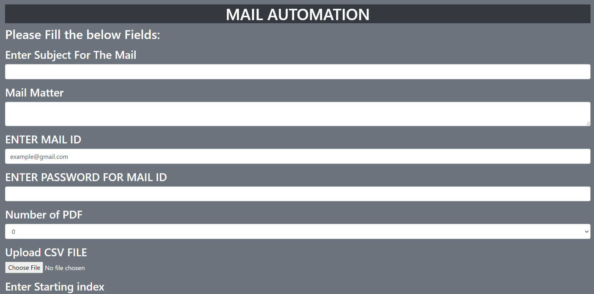
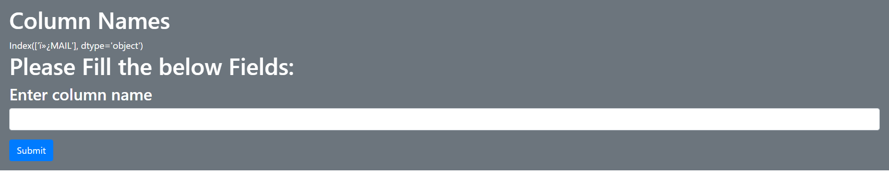

# Mail Automation

#### This is a mail automation software made using Python. Uses SMTP to send mails through gmail.
## Installation

* Clone the repostiory:
  ##### https://github.com/Shivang-Agarwal11/Mail-Automation.git by pasting this url in cmd.
* Open Terminal and change the current working directory to Mail Automation Directory.
* Run command "python manage.py runserver"
* Open the url listed in cmd.

#### ScreenShots:

 

## Installing Dependencies:
##### Run command "pip install -r requirements.txt" in your shell.
